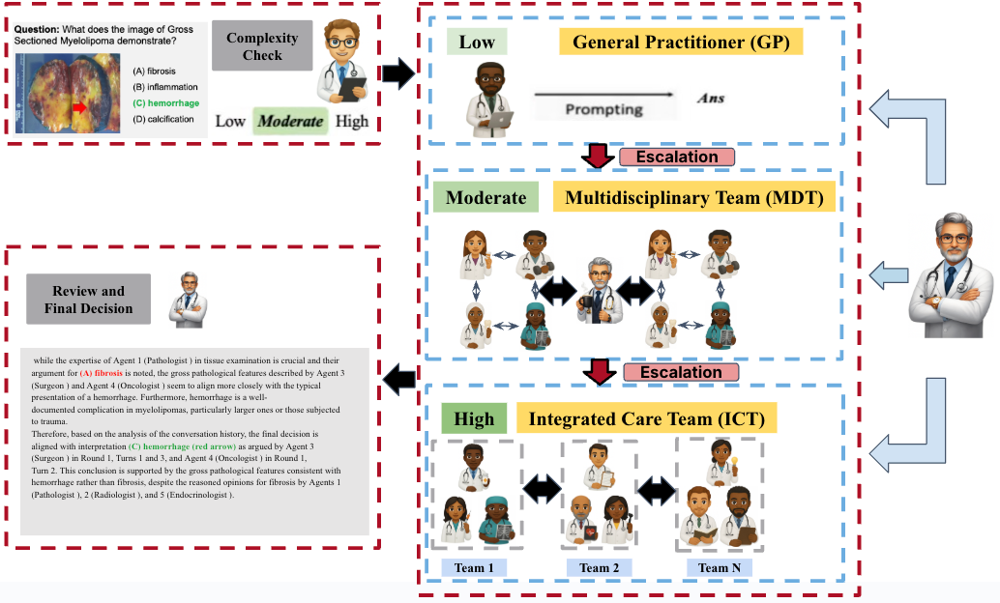

# AIM²: Adaptive Intelligent Medical Multi-Agents

> Adaptive multi-agent LLM framework that simulates clinical MDT / ICT workflows for medical decision-making.

Course project for **Columbia EECS6895 – Advanced Big Data and AI**.

- 📄 **Project report (PDF)**: [`docs/AIM2_report.pdf`](docs/AIM2_report.pdf)
- 🎥 **5-min overview video**: https://www.youtube.com/watch?v=HJUf1HcermQ
- 💻 **Code**: this repository

---

## 1. Overview

Large language models (LLMs) show strong potential in clinical applications, but most deployments still use
rigid prompting and single-agent reasoning. Real hospitals, in contrast, rely on **triage, referrals and
multidisciplinary teams (MDTs)** that adapt the depth of collaboration to each case.

**AIM² (Adaptive Intelligent Medical Multi-Agents)** is a multi-agent framework that:

- predicts whether a case is **low**, **moderate** or **high** complexity,
- recruits an appropriate team: **single GP**, **MDT** or **integrated care team (ICT)**,
- lets agents deliberate in **multi-round discussions** with a dedicated **challenger**,
- escalates only when necessary, and
- synthesises a final decision that can be read by **clinicians** and **patients**.

The superscript “2” denotes the dual pillars of the system:

1. **Multi-modal understanding** (text + medical images)
2. **Multi-agent coordination** (GP / MDT / ICT with escalation)

<div align="center">
  
  <br/>
  <em>Figure – Decision pathway in AIM²: difficulty check → GP / MDT / ICT with escalation.</em>
</div>

---

## 2. Method at a Glance

AIM² operates in four stages. :contentReference[oaicite:6]{index=6}

### 2.1 Stage 1 – Medical complexity check

A **DifficultyAgent** reads a compact summary (age, symptoms, vitals, imaging summary) and predicts:

- `low` – well-defined questions, standard pathways, manageable by a GP.
- `moderate` – interacting factors or mild uncertainty; small MDT within a specialty.
- `high` – multi-organ, multi-morbid or rare cases requiring an ICT.

It returns both a **label** and a short **rationale**, which drive the orchestration policy.

### 2.2 Stage 2 – Complexity-aware recruitment

A **Recruiter** assembles the team:

- `low`: **General Practitioner (GP)** only.
- `moderate`: **multidisciplinary team (MDT)** inside one department, plus a **Challenger**.
- `high`: **integrated care team (ICT)** spanning several departments (assessment, diagnosis,
  management), plus a **Challenger**.

Agents are drawn from a reusable **library of clinician roles** (cardiology, oncology, radiology,
psychiatry, …), each with a concise instruction and reasoning style.

### 2.3 Stage 3 – Multi-round discussion & escalation

For each round:

1. The **Moderator** broadcasts the case state to all agents.
2. Each expert writes a short note with:
   - a candidate answer,
   - key evidence, and
   - explicit uncertainties.
3. The **Challenger** attacks unsafe or inconsistent plans and points out missing tests.
4. A **Judge** scores the current solution on **correctness**, **completeness** and **safety**.
5. The Moderator checks **quality** and **consensus** and decides whether to:
   - stop,
   - continue for another round, or
   - **escalate** (low → moderate → high).

Round caps depend on complexity (e.g., low ≤ 2, moderate ≤ 4, high ≤ 4) and unresolved high-level cases
are explicitly marked as **uncertain** instead of over-confident. :contentReference[oaicite:7]{index=7}

### 2.4 Stage 4 – Decision synthesis

A **SynthesisAgent** aggregates the notes and uncertainty flags to produce:

- a **clinician-facing explanation** (technical, evidence-linked),
- optionally a **patient-facing summary** (plain language, emphasising safety and follow-up).

For moderate and high complexity cases the synthesis behaves like a **structured voting + narrative
report**, giving more weight to well-supported views and surfacing key disagreements. :contentReference[oaicite:8]{index=8}

---

## 3. Benchmarks & Main Results

AIM² is evaluated on **five medical QA benchmarks** covering text-only and image+text reasoning: :contentReference[oaicite:9]{index=9}

- **MedQA** – medical board-style multiple-choice questions.
- **PubMedQA** – questions about whether a paper’s conclusion supports a statement.
- **Path-VQA** – pathology images with short clinical questions.
- **PMC-VQA** – biomedical figures requiring integration of images, captions and domain knowledge.
- **MIMIC-CXR** – chest X-ray QA based on radiology reports.

We compare three settings:

- **Solo** – single LLM with zero/few-shot, CoT, self-consistency, MedPrompt, etc.
- **Group** – fixed multi-agent systems such as majority / weighted voting, MedAgents, ReConcile.
- **Adaptive (ours)** – full AIM² with complexity-aware recruitment + escalation.

### 3.1 Accuracy (single backbone model)

| Dataset    | Type       | Best Solo (%) | Best Group (%) | **AIM²** (%) |
|-----------:|-----------:|:-------------:|:--------------:|:------------:|
| MedQA      | text       | 83.9          | 81.3           | **82.7**     |
| PubMedQA   | text       | 63.1          | 79.7           | **74.0**     |
| Path-VQA   | image+text | 61.4          | 63.1           | **64.0**     |
| PMC-VQA    | image+text | 53.4          | 42.6           | **55.1**     |
| MIMIC-CXR  | image+text | 49.2          | 54.5           | **54.0**     |

(Values reproduced from the project report; ± std omitted here for brevity.) :contentReference[oaicite:10]{index=10}  

### 3.2 Ablation highlights

- **Complexity selection vs. static MDT/ICT**  
  An escalation policy (low → moderate → high as needed) outperforms always-low / always-moderate /
  always-high configurations on all five datasets, while reducing unnecessary collaboration on easy cases.

- **Number of agents**  
  Small teams (2–3 specialists) plus escalation recover most of the gains of large ICT-style teams,
  but with far fewer model calls per query.

- **Robustness to temperature**  
  AIM² remains stable and often improves at higher decoding temperatures, suggesting that multi-round
  discussion + escalation can better exploit diverse reasoning paths than solo or fixed-group baselines.

---

## 4. Repository Structure

```text
E6895-AIM/
├── README.md
├── LICENSE
├── requirements.txt
├── .gitignore
│
├── docs/
│   ├── AIM2_report.pdf          # project report
│   └── aim2_decision_pathway.png# figure used in README
│
├── src/
│   ├── __init__.py
│   ├── utils.py                 # helpers (HF login, model loading, config)
│   ├── app.py                   # Gradio interface + CLI entrypoint
│   │
│   ├── agents/
│   │   ├── __init__.py
│   │   ├── vision_expert.py     # VisionExpert
│   │   ├── difficulty_agent.py  # DifficultyAgent
│   │   ├── recruiter.py         # Recruiter
│   │   ├── expert_agent.py      # Generalist / Specialist agents
│   │   ├── challenger_agent.py  # Challenger
│   │   └── moderator_agent.py   # Moderator + Judge orchestration
│   │
│   └── engine/
│       ├── __init__.py
│       └── discussion_engine.py # Discussion / escalation engine
│
└── tests/
    └── test_agents.py           # pytest unit tests
